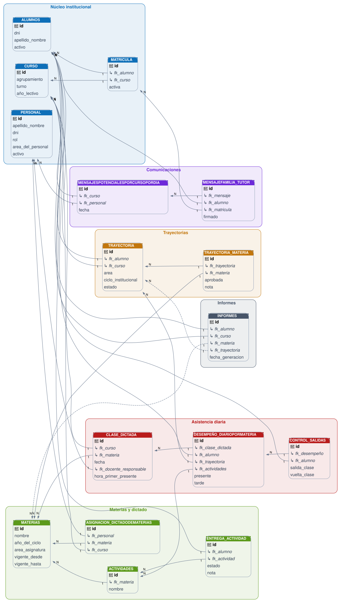

# GestorESRN

Consiste en una Aplicación móvil experimental para la gestión de asistencia, desempeño académico y trayectorias escolares en Escuelas Secundarias Río Negrinas (ESRN) — instituciones de reingreso educativo donde no existe la repitencia de año, sino la aprobación de trayectorias por área de conocimiento.

> ⚠️ **Proyecto en fase experimental / prototipo.** El modelo de datos, las pantallas y la arquitectura descriptos en este documento son la base inicial y están sujetos a cambios a medida que se valide la herramienta con uso real en el ámbito escolar.

## Índice

- [Motivación](#motivación)
- [Stack tecnológico](#stack-tecnológico)
- [Estado actual del proyecto](#estado-actual-del-proyecto)
- [Estructura de carpetas](#estructura-de-carpetas)
- [Modelo de datos (resumen)](#modelo-de-datos-resumen)
- [Datos mock vs. datos reales](#datos-mock-vs-datos-reales)
- [Convenciones de código](#convenciones-de-código)
- [Equipo](#equipo)

## Motivación

Las ESRN son escuelas secundarias donde el docente está implicado en múltiples roles y resulta crítico llevar un control detallado de:

- La asistencia diaria de los alumnos, incluyendo salidas y regresos durante el horario de clase (por ejemplo, al baño o a sacar fotocopias).
- El desempeño académico día a día (trabajo en clase, participación oral, entrega de actividades).
- Las **trayectorias académicas parciales por área**, ya que en este tipo de escuela la aprobación es "todo o nada" por área de conocimiento y año, y un alumno puede adeudar trayectorias parciales de varios años anteriores simultáneamente mientras cursa años superiores.
- La comunicación institucional con las familias (autorizaciones, notificaciones), a modo de cuaderno de comunicaciones digital.

GestorESRN busca digitalizar y simplificar este seguimiento para docentes y administrativos, reduciendo la carga manual en papel.

## Stack tecnológico

- **React Native** + **Expo** + **Expo Router**
- **TypeScript**
- **Supabase** (Postgres + Auth) — base de datos definitiva, todavía no integrada (ver [Estado actual](#estado-actual-del-proyecto))

## Estado actual del proyecto

El proyecto se encuentra en la etapa de **prototipado con datos mock locales**, sin conexión a Supabase todavía. El objetivo de esta etapa es validar la lógica de negocio, las pantallas y los flujos de uso antes de conectar la base de datos real.

El diseño de la app sigue el patrón de **repositorio de datos**: los tipos TypeScript, los hooks y las pantallas están escritos contra la forma final que van a tener los datos en Supabase. La única capa que cambia al migrar es la implementación del cliente de datos (`lib/data/client.ts`) — el resto de la aplicación no se ve afectado por el cambio de fuente de datos.

## Estructura de carpetas

```
src/
  app/                       # Rutas (Expo Router)
    _layout.tsx
    (public)/
      login.tsx
    (admin)/                 # Route group exclusivo del rol Admin
      personal/
      alumnos/
      materias/
      cursos/
    (teacher)/                # Route group exclusivo del rol Profesor
      cursos/[cursoId]/materias/[materiaId]/
        asistencia.tsx
        alumno/[alumnoId].tsx
        actividades.tsx
      mensajes/
      informes/

  features/                  # Lógica de negocio agrupada por dominio
    auth/
    personal/
    alumnos/
    cursos/
    materias/
    trayectorias/
    asistencia/               # Clase_Dictada + Desempeño + Control_Salidas
    mensajes/
    informes/

  components/
    ui/                       # Componentes genéricos reutilizables
    alumnos/
    cursos/
    asistencia/
    trayectorias/
    mensajes/

  lib/
    data/
      types/                  # Tipos TypeScript calcados 1:1 de las tablas de Supabase
      mock/                   # Datos de prueba locales (fase actual)
      client.ts                # Único punto de cambio mock → Supabase
    api/                      # Clientes de APIs externas (ej. hora/fecha)
    storage/                  # Persistencia segura (tokens, etc.)

  constants/
    theme.ts                  # Colores, tipografía, espaciados institucionales
```

> Esta estructura es intencionalmente liviana para la fase de prototipo. Se espera que se complejice (por ejemplo, separando mejor capas de dominio/infraestructura) a medida que el proyecto avance.

## Modelo de datos (resumen)

Entidades principales del sistema:

| Entidad | Descripción |
|---|---|
| `Personal` | Docentes y administradores. Una misma persona puede tener más de una cuenta si ejerce más de un rol. |
| `Alumnos` / `Matricula` | Alumnos y su historial de matriculación por curso y año lectivo. |
| `Curso` | Año + división + turno + año lectivo (ej. "3°2° Tarde 2026"). |
| `Materias` / `Asignacion_DictadoDeMaterias` | Materias dictadas, con vigencia por año lectivo, y su asignación a docentes y cursos (relación muchos a muchos). |
| `Trayectoria` / `Trayectoria_Materia` | El núcleo del sistema ESRN: seguimiento de aprobación por área y año, con checklist fijo de qué materias la componen (independiente de si hubo o no clases registradas digitalmente). |
| `Clase_Dictada` / `Desempeño_DiarioPorMateria` / `Control_Salidas` | Registro diario de clases: asistencia, llegadas tarde, trabajo en clase, participación oral, y salidas/regresos durante el horario de clase. |
| `Actividades` / `Entrega_Actividad` | Trabajos prácticos propuestos por materia y su seguimiento de entrega/corrección por alumno. |
| `MensajesPotencialesPorCursoPorDia` / `MensajeFamilia_Tutor` | Cuaderno de comunicaciones digital: mensajes a familias y seguimiento de autorizaciones firmadas. |
| `Informes` | Cálculo de porcentajes de asistencia, trabajo y participación (por materia o totalizado por área), e informes cualitativos. |

## Datos mock

Durante esta fase de prototipo, los datos de alumnos y personal utilizados en el mock **no corresponden a personas reales**, ya que el objetivo es validar funcionalidad y flujos, no testear todavía con información sensible real.

## Esquema lógico de la Base de datos



## Convenciones de código

- **snake_case** para todo campo que represente una columna de las tablas (tanto en los tipos TypeScript como en los objetos que circulan en la app), para evitar una capa de mapeo entre la app y Supabase.
- **camelCase** para el resto del código (nombres de funciones, hooks, componentes, estado local de UI), como es convención estándar en JavaScript/TypeScript.
- Arquitectura modular por *feature*, con capas livianas de presentación (pantallas/componentes), aplicación (hooks) e infraestructura (services/cliente de datos).

## Equipo

- **Emiliano Spagnolo**
- **Agustín Soto**

---

*Instituto Técnico Superior Cipolletti — Proyecto experimental desarrollado en el marco de la Tecnicatura Superior en Desarrollo de Software Full Stack.*
